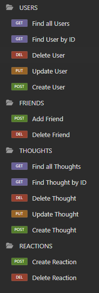

# Social Network API
API for a social network web application where users can share their thoughts, react to friends’ thoughts, and create a friend list.

[](http://choosealicense.com/licenses/mit/)

## Description

This project is a backend database and server API to be paired with a potential frontend for a social networking web application.  

- Although this application uses a non-relational database, functionality has been implemented for it to behave similarly to a object-relational database.  For example, when a user is deleted their associated thoughts will also be deleted.
- Usernames and emails are forced to be unique and emails are validated for proper syntax.  
- The User model has a virtual property to return the friend count of a user when queried.  The Thought model has a virtual property to return the reaction count of a thought when quieried.  
- Timestamps for `"createdAt"` data of documents use a getter method to reformat the timestamp data into a more readable format.  The date-fns NPM package is utilized to reformat the native JavaScript's Date object data.
- This project experiments with converting Mongoose documents to plain JavaScript objects and then adding query type, time of query, and message properties to gain more insights when returning responses from requests.  I would consider doing this more in the future.  

## Table of Contents

- [Installation](#installation)
- [Usage](#usage)
- [Examples](#examples)
- [Credits](#credits)
- [License](#license)
- [Questions](#questions)

## Installation

This application requires a runtime environment with Node.js using Express.js for routing, a MongoDB database, and the Mongoose ODM.  With Node.js installed, clone the GitHub repository, then install dependencies in the project directory by running the following code in the terminal: `npm install`

Here is the [Code Repository](https://github.com/briandwach/social-network-api) and a [Video Demonstration](https://drive.google.com/file/d/1aOHEf7MT0y7-jROuGjWsiAzSPHTLIpuD/view?usp=sharing) of the application.

## Usage

Navigate to the root directory of the project and execute `node index.js` in the terminal.  The application will connect to the database and the server will begin listening for requests.  

The following image and code samples detail the type of requests that can be made to query the database:



```
// /api/users
router.route('/').get(getUsers).post(createUser);

// /api/users/:userId
router.route('/:userId').get(getSingleUser).put(updateUser).delete(deleteUser);

// /api/users/:userId/friends/:friendId
router.route('/:userId/friends/:friendId').post(addFriend).delete(removeFriend);

// /api/thoughts
router.route('/').get(getThoughts).post(createThought);

// /api/thoughts/:thoughtId
router.route('/:thoughtId').get(getSingleThought).put(updateThought).delete(deleteThought);

// /api/thoughts/:thoughtId/reactions
router.route('/:thoughtId/reactions').post(createReaction);

// /api/thoughts/:thoughtId/reactions/:reactionId
router.route('/:thoughtId/reactions/:reactionId').delete(deleteReaction);
```

## Examples

Example request data for creating a new user: 

```
{
  "username": "Bowie",
  "email": "bowie@cat.com"
}
```
Example request data for creating a new thought:
```
{
  "thoughtText": "I like to take naps.",
  "username": "Bowie",
  "userId": "662871f490c100d52b8c8439"
}
```
Example request data for creating a new reaction:
```
{
  "reactionBody": "Yes, or take a break and have a snack.",
  "username": "Winnie",
  "userId": "6628720190c100d52b8c843d"
}
```
Example additional response properties returned in JSON objects: `"query", "timeOfQuery", "message"`
```
{
	"query": "Add Friend",
	"timeOfQuery": "Apr 24, 2024, 10:29:12 PM",
	"message": "Friend successfully added",
	"_id": "6629cdd78e7526ce20987eb1",
	"username": "Yoshi",
	"email": "yoshi@mushroomkingdom.com",
	"thoughts": [],
	"friends": [
		"6628720190c100d52b8c843d"
	],
	"__v": 0,
	"friendCount": 1
}
```
Example of virtual properties computed during queries: `"friendCount", "reactionCount"`
```
{
	"query": "Find User by ID",
	"timeOfQuery": "Apr 24, 2024, 10:29:17 PM",
	"_id": "6629cd3a8e7526ce20987e90",
	"username": "Bowie",
	"email": "bowie@cat.com",
	"thoughts": [
		{
			"_id": "6629cd5f8e7526ce20987e94",
			"thoughtText": "Time to eat.",
			"username": "Bowie",
			"createdAt": "Apr 24, 2024, 10:26:23 PM",
			"reactions": [
				{
					"reactionBody": "Don't forget to take a break and have a snack.",
					"username": "Winnie",
					"_id": "6629cd848e7526ce20987e9b",
					"reactionId": "6629cd848e7526ce20987e9c",
					"createdAt": "Apr 24, 2024, 10:27:00 PM"
				},
				{
					"reactionBody": "I agree.",
					"username": "Winnie",
					"_id": "6629cd8e8e7526ce20987e9f",
					"reactionId": "6629cd8e8e7526ce20987ea0",
					"createdAt": "Apr 24, 2024, 10:27:10 PM"
				},
				{
					"reactionBody": "Let's get tacos sometime.",
					"username": "Winnie",
					"_id": "6629cd9b8e7526ce20987ea4",
					"reactionId": "6629cd9b8e7526ce20987ea5",
					"createdAt": "Apr 24, 2024, 10:27:23 PM"
				}
			],
			"__v": 0,
			"reactionCount": 3
		}
	],
	"friends": [
		{
			"_id": "6628720190c100d52b8c843d",
			"username": "Winnie",
			"email": "winnie@cat.com",
			"thoughts": [],
			"friends": [],
			"__v": 0,
			"friendCount": 0
		},
		{
			"_id": "6629cdd78e7526ce20987eb1",
			"username": "Yoshi",
			"email": "yoshi@mushroomkingdom.com",
			"thoughts": [],
			"friends": [
				"6628720190c100d52b8c843d"
			],
			"__v": 0,
			"friendCount": 1
		}
	],
	"friendCount": 2
}
```

## Credits
The JavaScript date library, [date-fns](https://www.npmjs.com/package/date-fns), developed by [Sasha Koss](https://github.com/kossnocorp) is used in this application to format timestamps.

## License
This application is covered under the [MIT License](http://choosealicense.com/licenses/mit/).

## Questions
Please email me with any questions regarding this application at: brian.d.wach@gmail.com

Additionally, checkout more of my work on GitHub: [briandwach](https://github.com/briandwach)